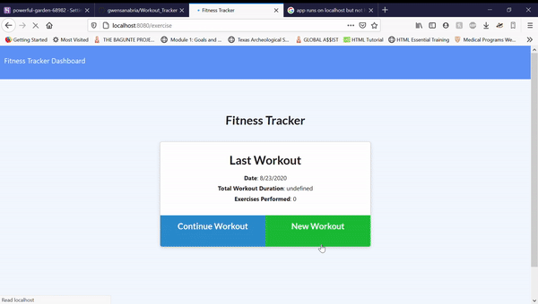

# Workout Tracker

## User Story
As a user, I want to be able to add workouts to the app so that I can have the information stored and tracked.

## Getting Started
Currently troubleshooting deployment issue to Heroku. Link is [here.](https://powerful-garden-68982.herokuapp.com/) For now fork and clone the repository and run 'npm i' to install necessary dependencies. Then do 'npm start' to run on local host.

## Use
* Select 'New Workout' to create a new workout.
  * Fill in options/blanks.
* Select 'Continue Workout' to add a new exercise to a pre-existing workout.
  * Fill in options/blanks.
* Select 'Dashboard' to see infographics of your workouts.

## License
